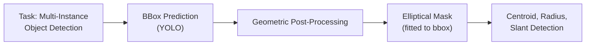
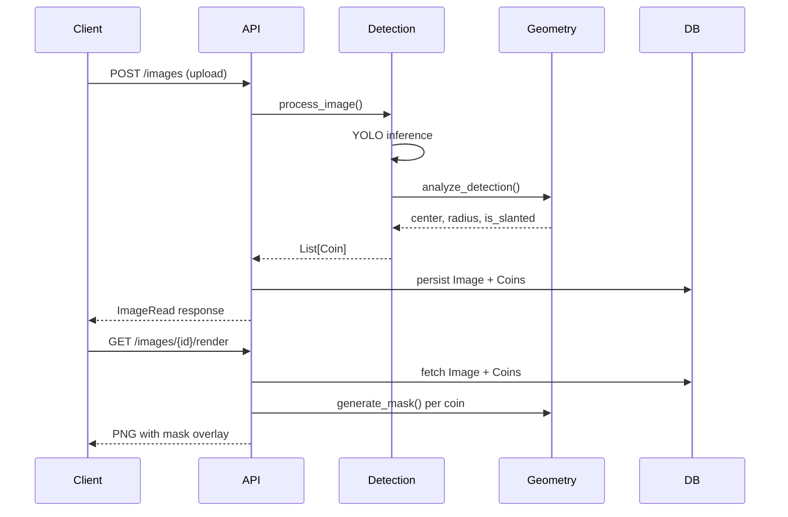
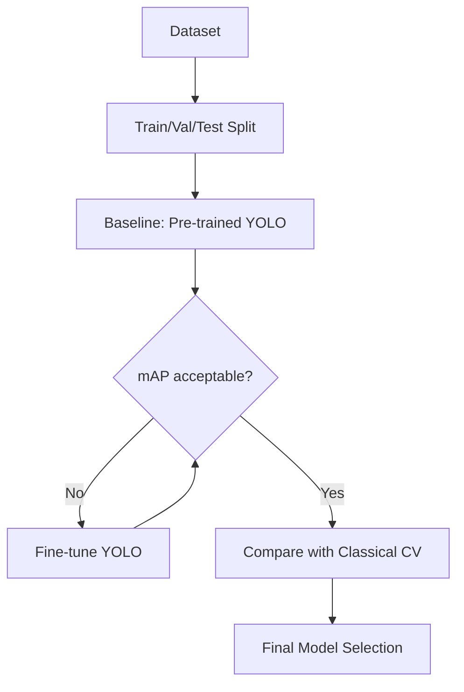

# Circular Object Detection Challenge (Coins)

> separating circular objects (coins) in foreground images.

[](https://www.python.org/downloads/)
[](https://fastapi.tiangolo.com)
[](https://www.docker.com/)

---

## Table of Contents

- [Overview](#overview)
- [Problem Analysis & Decision Matrix](#problem-analysis--decision-matrix)
- [Architecture](#architecture)
- [Quick Start](#quick-start)
- [API Reference](#api-reference)
- [Development](#development)
- [Evaluation Strategy](#evaluation-strategy)
- [Future Roadmap](#future-roadmap)

---

## Overview

This solution addresses the challenge of **separating circular objects (coins) in foreground images** with the following capabilities:

- ✅ **Image upload** with persistent storage
- ✅ **Unique identifier assignment** for each detected coin
- ✅ **Bounding box, centroid, and radius** retrieval per coin
- ✅ **Mask generation** via geometric post-processing (elliptical fit)
- ✅ **Visualization endpoint** displaying mask overlay on original image
- ✅ **Containerized solution** ready for deployment

---

## Problem Analysis & Decision Matrix

> This section documents the analytical approach taken to understand the problem and design the solution.

### Dataset Exploration Summary

| Metric | Value |
|--------|-------|
| Total images | 191 |
| Total annotations | 521 |
| Annotations per image | 2.73 (avg), 2 (median) |
| Max objects per image | 14 |
| Min objects per image | 1 |
| Resolution range | 194×194 to 2048×2048 px |

### Key Observations

| Aspect | Observation | Impact on Design |
|--------|-------------|------------------|
| **Annotation Format** | COCO-style with bounding boxes only; all segmentation arrays empty | Cannot train supervised instance segmentation directly |
| **Coin Shape** | ~8% of coins have aspect ratio outside 0.8-1.2 (slanted/tilted) | Rigid circular masks would fail; elliptical fitting required |
| **Scene Complexity** | Varied backgrounds, lighting, overlapping coins | Robust detection model needed |
| **Multi-instance** | 1-14 coins per image | Object detection framing handles this natively |

### Visual Dataset Characteristics

| Aspect | Observation |
|--------|-------------|
| **Background & Lighting** | Varied: plain, textured, cluttered; diverse lighting with shadows/glare |
| **Coin Characteristics** | Multiple denominations, varied sizes, reflective surfaces |
| **Scene Composition** | 1-14 coins, partial occlusion, scattered spatial distribution |
| **Quality Challenges** | Motion blur possible, boundary occlusion, scale variation |

### Design Decision Matrix

| Challenge | Options Considered | Decision | Rationale |
|-----------|-------------------|----------|-----------|
| **No segmentation GT** | (A) Train Mask R-CNN with pseudo-masks<br>(B) Use detection + geometric post-processing<br>(C) Classical CV (Hough circles) | **B** | Geometric masks from bbox are accurate for circular/elliptical objects; no training overhead |
| **Slanted coins (~8%)** | (A) Circular mask (radius = max dimension)<br>(B) Elliptical mask fitted to bbox | **B** | Ellipse preserves aspect ratio, handles tilt naturally |
| **Mask IoU evaluation** | (A) Pixel-wise IoU<br>(B) Detection mAP + counting accuracy | **B** | No pixel-level GT available; detection mAP is standard; counting accuracy is practical |
| **Detection model** | (A) Train from scratch<br>(B) Fine-tune YOLO<br>(C) Use pre-trained YOLO | **C → B** | Start with pre-trained for MVP; fine-tune for production accuracy |
| **Overlapping coins** | (A) Instance segmentation<br>(B) Object detection (separate bboxes) | **B** | Detection naturally handles overlap by predicting separate boxes |

### Problem Reframing



**Key Insight**: By framing this as object detection + geometric post-processing, we:
1. Leverage robust pre-trained detectors (YOLO)
2. Handle overlapping coins naturally (separate detections)
3. Generate accurate masks without pixel-level supervision
4. Produce consistent, deterministic outputs

---

## Architecture

```
coin-detection-api/
├── app/
│   ├── api/              # FastAPI routes
│   │   └── routes.py     # Endpoint definitions
│   ├── core/             # Configuration & database
│   │   ├── config.py     # Centralized settings
│   │   └── db.py         # SQLite + SQLModel
│   ├── db/               # Database models
│   │   └── models.py     # Image, Coin tables
│   └── services/         # Business logic
│       ├── detection.py  # YOLO inference
│       └── geometry.py   # Ellipse fitting, mask generation
├── artifacts/
│   └── models/           # YOLO weights
├── data/                 # Runtime data (gitignored)
│   └── uploads/          # Uploaded images
└── tests/                # Unit tests
```

### Data Flow



---

## Quick Start

### Docker (Recommended)

```bash
# Build and run
docker-compose up --build

# API available at http://localhost:8000
# Docs at http://localhost:8000/docs
```

### Local Development

```bash
# Create virtual environment
python -m venv .venv
source .venv/bin/activate

# Install dependencies
make dev

# Run API
make run
```

---

## API Reference

| Method | Endpoint | Description |
|--------|----------|-------------|
| `POST` | `/api/v1/images` | Upload image, triggers detection |
| `GET` | `/api/v1/images/{id}` | Get image details with coin list |
| `GET` | `/api/v1/coins/{id}` | Get specific coin details (bbox, centroid, radius) |
| `GET` | `/api/v1/images/{id}/render` | Visualize masks overlaid on image |
| `GET` | `/api/v1/health` | Health check |

### Example Usage

```bash
# Upload image
curl -X POST "http://localhost:8000/api/v1/images" \
  -F "file=@coin_image.jpg"

# Response:
{
  "id": "a1b2c3d4",
  "filename": "a1b2c3d4.jpg",
  "coins": [
    {
      "id": "a1b2c3d4_coin_001",
      "center_x": 150.5,
      "center_y": 200.3,
      "radius": 45.0,
      "is_slanted": false,
      "bbox_x": 105.5,
      "bbox_y": 155.3,
      "bbox_w": 90.0,
      "bbox_h": 90.0
    }
  ]
}

# Get rendered visualization
curl "http://localhost:8000/api/v1/images/a1b2c3d4/render" --output render.png
```

---

## Development

### Available Commands

```bash
make help         # Show all commands
make dev          # Install dev dependencies
make test         # Run tests
make test-cov     # Run tests with coverage
make lint         # Check code style
make format       # Auto-format code
make docker-up    # Start containers
make docker-down  # Stop containers
```

### Project Structure

- **`app/core/config.py`**: Centralized configuration via environment variables
- **`app/services/detection.py`**: YOLO model wrapper, singleton pattern
- **`app/services/geometry.py`**: Pure geometric calculations (testable, no ML dependencies)
- **`app/db/models.py`**: SQLModel definitions with relationships

---

## Evaluation Strategy

Given the dataset constraints (bounding boxes only, no pixel-level masks), the evaluation approach focuses on:

### Primary Metrics

| Metric | Description | Target |
|--------|-------------|--------|
| **mAP@0.5:0.95** | COCO-style detection mAP | Standard benchmark |
| **Counting Accuracy** | % images with correct coin count | High priority for practical use |
| **Inference Time** | ms per image | < 500ms for production |

### Why Not Pixel-Level IoU?

- No ground truth masks available in dataset
- Geometric masks are deterministic given bbox → mask quality depends entirely on detection quality
- Detection mAP directly correlates with final output quality

### Planned Evaluation Workflow



---

## Next Planned Steps

- [ ] **Metrics module**: Implement mAP calculation and counting accuracy
- [ ] **Train/test split**: Proper dataset partitioning for evaluation
- [ ] **Baseline evaluation**: Assess pre-trained YOLO performance
- [ ] **Fine-tuning**: YOLO fine-tuning on coin dataset
- [ ] **Classical CV comparison**: Hough circles as baseline
- [ ] **Structured logging**: Production-grade observability
- [ ] **Pluggable architecture**: Swappable detectors and metrics
- [ ] **API hardening**: Rate limiting, input validation, error handling

---

## License

MIT

---

## Acknowledgments

Built as part of a technical assessment challenge 1
