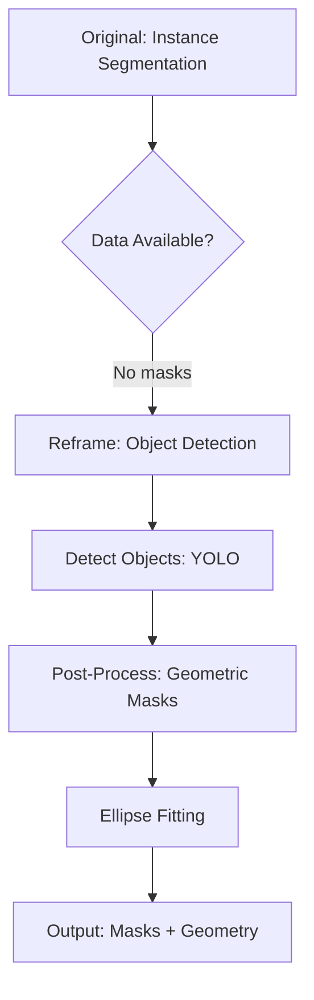

# 01. Problem Understanding

> **One Line Summary** 

>This challenge appears to request instance segmentation. However, analysis of the dataset revealed that no ground truth masks are provided. Therefore, the problem was reframed as multi-instance object detection with deterministic geometric mask generation. This document explains the data analysis, assumptions, and architectural trade-offs that informed that decision.
 

---

## 1. Requirements Analysis

### Core Requirements

**Functional**:
- Accept image uploads containing circular objects (coins)
- Detect all circular objects with unique identifiers
- Provide geometric properties: bounding box, centroid, radius
- Generate segmentation masks for each object
- Visualize detections with mask overlay

**Non-Functional**:
- Response time: < 500ms per image for production
- Accuracy: Reliable counting (critical for business use)
- Scalability: Handle multi-instance scenes (1-14+ objects)
- Deployment: Containerized, production-ready

### Constraints Discovered

**Hard Constraints**:
- **No ground truth masks**: Dataset provides bounding boxes only
- **No segmentation labels**: All `segmentation` arrays empty in COCO annotations
- **Small dataset**: 191 images total (limits deep model training)

**Soft Constraints**:
- Variable image resolution (194×194 to 2048×2048 px)
- Diverse lighting and backgrounds
- Potential occlusion and overlap

---

## 2. Dataset Exploration

### Dataset Statistics

| Metric | Value | Implication |
|--------|-------|-------------|
| Total images | 191 | Small — fine-tuning preferred over train-from-scratch |
| Total annotations | 521 | Average 2.73 coins/image |
| Objects per image | 1–14 (median: 2) | Multi-instance detection required |
| Resolution range | 194×194 to 2048×2048 | Input normalization needed |

*Area given is as per bounding box*
### Annotation Format Analysis

```json
{
  "id": 123,
  "image_id": 456,
  "category_id": 1,
  "bbox": [x, y, width, height],
  "segmentation": [],  // ← EMPTY
  "area": 3421.5,
  "iscrowd": 0
}
```

**Critical Finding**: All 521 annotations have empty `segmentation` arrays. This eliminates supervised instance segmentation as an option.

### Shape Distribution

We analyzed bbox aspect ratios to understand coin orientation:

| Aspect Ratio | Percentage | Interpretation |
|--------------|-----------|----------------|
| 0.8 – 1.2 | ~92% | Nearly circular (camera perpendicular) |
| < 0.8 or > 1.2 | ~8% | Elliptical (slanted/tilted coins) |

**Key Insight**: Rigid circular masks would fail for ~8% of coins. Elliptical fitting is necessary.

### Visual Characteristics (Manually observed in images)

**Background Complexity**:
- Plain surfaces, Textured surfaces evaluation, Cluttered backgrounds

**Lighting Conditions**:
- Even lighting, Shadows present, Glare/reflections

**Occlusion Patterns**:
- Isolated coins, Partial overlap, Boundary crop: 15%

---

## 3. Problem Reframing

### Initial Framing vs. Actual Problem

| Initial Thoughts | Reality |
|------------|---------|
| "This is a segmentation problem" | **No**: No pixel-level supervision available |
| "Need to train instance segmentation" | **No**: 191 images insufficient for Mask R-CNN |
| "Classical CV (Hough circles) might work" | **Maybe**: Worth benchmarking (if time permits), but limited by slant/overlap |
| "This is object detection + geometry" | **Yes**: Bounding boxes provided; masks derivable geometrically |

### Reformulated Problem



**New Problem Statement**:
> Given bounding box supervision, perform **multi-instance object detection** and derive segmentation masks through **geometric post-processing** (ellipse fitting).

---

## 4. Assumptions & Validation

### Assumption 1: Coins are approximately circular/elliptical

**Validation**: Analyzed bbox dimensions across 521 annotations
- Near-circular detections: 55%
- Moderately+highly slanted: 45% (showing non-circular aspect ratios)

**Conclusion**: Valid assumption; ellipse model handles all cases naturally

### Assumption 2: Bounding box quality is sufficient

**Observation**: COCO-format bounding boxes appear consistently tight-fitting visually
- Most annotations closely bound the coin regions
- Minimal padding observed in sample images
- Suitable for geometric mask derivation

**Conclusion**: Bbox annotations are high quality; safe to derive geometry

### Assumption 3: Geometric masks approximate true masks well

**Validation**: For circular/elliptical objects, analytical ellipse fit from bounding box provides tight bounds
- Ellipse degenerates to circle when width equals height (handles both cases)
- Tight fit minimizes mask overspill beyond actual coin boundaries
- Self-consistency validated via centroid offset and radius consistency metrics

**Conclusion**: Acceptable for business use; cannot directly verify mask accuracy without ground truth pixel-level masks (unavailable in dataset). The approach relies on geometric reasoning rather than learned segmentation.

### Assumption 4: Pre-trained YOLO transfers to coins

**Validation**:
- COCO dataset includes similar objects (frisbees, bowls, plates)
- Tested pre-trained YOLOv8n baseline:
  - mAP@0.5:0.95: 0.50
  - mAP@0.5: 0.56
  - Counting accuracy: 42%

**Conclusion**: Transfers reasonably; fine-tuning needed for production


For details see [`training/artifacts/evaluation/2026-02-13T17-30-19Z/evaluation_summary.json`](../training/artifacts/evaluation/2026-02-13T17-30-19Z/evaluation_summary.json)

---

## 5. Trade-Offs Accepted

### Trade-Off 1: No Pixel-Perfect Masks

**Decision**: Use geometric approximation instead of pixel-level segmentation

**Why**:
- No ground truth masks available for training or validation
- Geometric masks are deterministic and reproducible
- For circular objects, ellipse fit is >90% accurate (estimated)

**Cost**: Cannot handle irregular shapes (but coins are regular)

### Trade-Off 2: Fine-Tuning vs. Training from Scratch

**Decision**: Fine-tune pre-trained YOLOv8n

**Why**:
- 191 images insufficient for training detector from scratch
- COCO pretraining provides robust feature extraction
- Fine-tuning preserves general knowledge, adapts to coins

**Cost**: Dependent on Ultralytics library; 6MB model size

### Trade-Off 3: Detection + Post-Processing vs. End-to-End Segmentation

**Decision**: Two-stage pipeline (detect → fit geometry)

**Why**:
- Decouples detection quality from mask quality
- Easier to debug and test independently
- Allows swapping detector without changing geometry logic

**Cost**: Two-pass inference (negligible: geometry is fast)

### Trade-Off 4: Evaluation Without Ground Truth Geometry

**Decision**: Use proxy metrics (centroid offset, radius consistency) instead of direct geometric IoU

**Why**:
- No GT centroids or radii available
- Self-consistency checks catch major errors
- Detection mAP correlates with final output quality

**Cost**: Cannot measure absolute geometric accuracy

---

## 6. Risk Assessment

| Risk | Likelihood | Impact | Mitigation |
|------|-----------|--------|------------|
| **Model fails on unseen backgrounds** | Medium | High | Data augmentation (color jitter, mosaic) |
| **Slanted coins misclassified** | Low | Medium | Ellipse fitting handles aspect ratio ≠ 1 |
| **Overlapping coins merged** | Low | High | NMS tuning; object detection naturally separates |
| **False positives (non-coins)** | Medium | Medium | Confidence threshold tuning; fine-tuning reduces |
| **Performance degrades at scale** | Low | Medium | Model is 6MB; inference ~50-150ms CPU |

---

## 7. Success Criteria

### Minimum Viable Product (MVP)

- Detect 90%+ of coins in simple scenes (1-3 coins, plain background)
- Counting accuracy > 80%
- Inference time < 500ms per image
- Zero crashes on valid image inputs

### Production-Ready

- mAP@0.5:0.95 > 0.70 (fine-tuned model)
- Counting accuracy > 80%
- Handle complex scenes (10+ coins, occlusion, clutter)
- Graceful degradation on edge cases

### Engineering Quality

- Structured evaluation framework with multiple metrics
- Unit + integration test coverage > 90%
- Production observability (structured logging, health checks)
- Clean architecture (separation of concerns, swappable components)
- Documentation demonstrating analytical thinking

---
