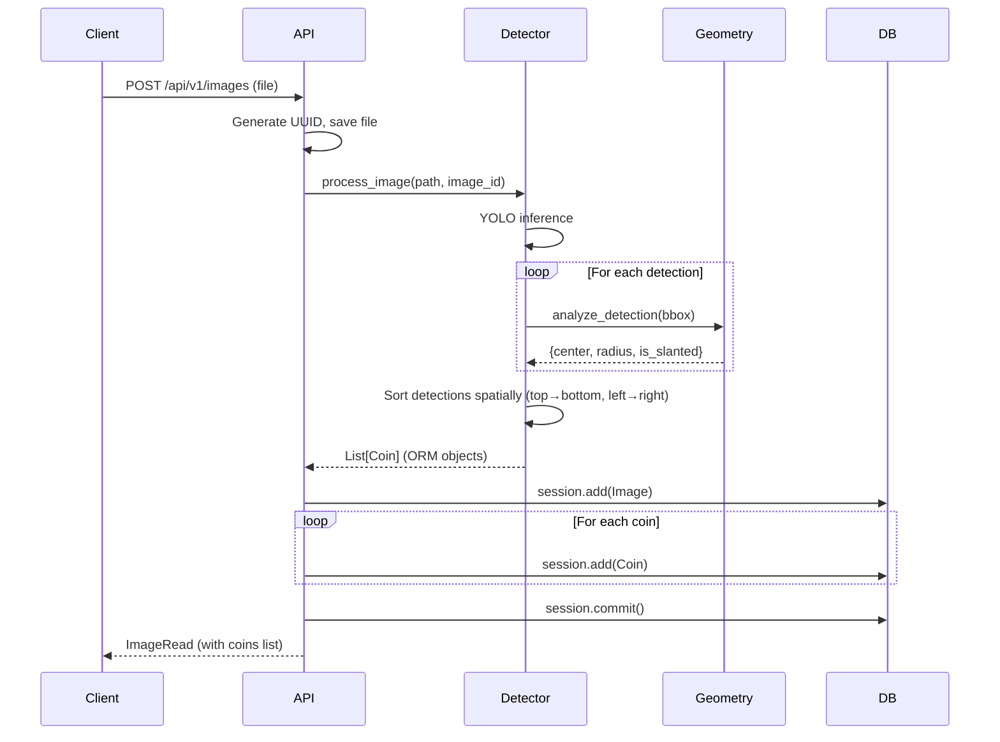
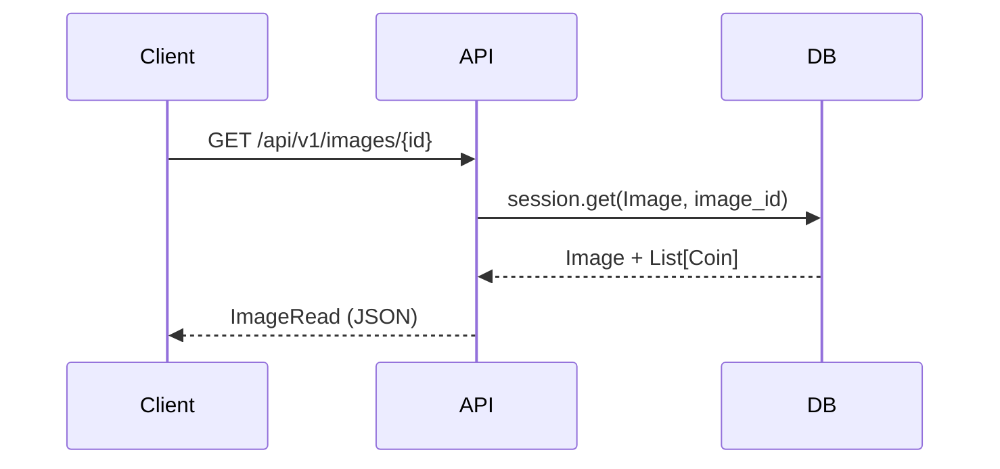
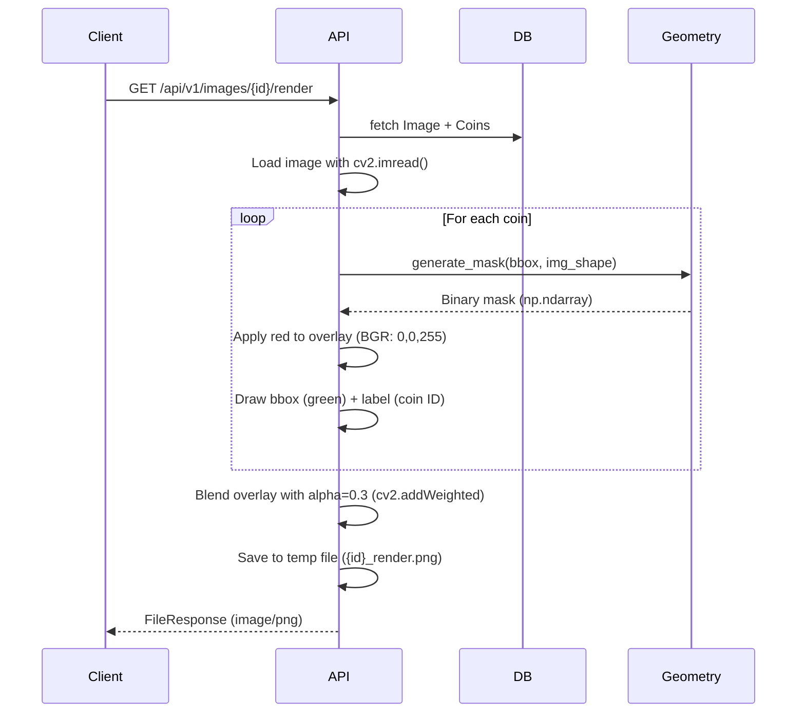

# 02. Architecture Overview

> **Summary**: This document outlines the architectural principles and system design decisions taken to prioritize maintainability, testability and production readiness

---

## 1. System Architecture

### High-Level Components

>The system follows a layered architecturre with explicit boundaries between transport (API), orchestration (services) and persistence.

```
┌─────────────────────────────────────────────────────────────┐
│                        API Layer (FastAPI)                   │
│  ┌──────────────┐  ┌──────────────┐  ┌──────────────┐      │
│  │   Upload     │  │   Retrieve   │  │  Visualize   │      │
│  │   Endpoint   │  │   Endpoint   │  │   Endpoint   │      │
│  └──────┬───────┘  └──────┬───────┘  └──────┬───────┘      │
└─────────┼──────────────────┼──────────────────┼─────────────┘
          │                  │                  │
          ▼                  ▼                  ▼
┌─────────────────────────────────────────────────────────────┐
│                     Service Layer                            │
│  ┌──────────────────────┐      ┌──────────────────────┐    │
│  │ DetectionService     │      │  GeometryService     │    │
│  │ (YOLO singleton)     │──────▶  (Pure functions)    │    │
│  └──────────────────────┘      └──────────────────────┘    │
└─────────────────────────────────────────────────────────────┘
          │                                    │
          ▼                                    ▼
┌─────────────────────────────────────────────────────────────┐
│                   Persistence Layer                          │
│  ┌──────────────────────┐      ┌──────────────────────┐    │
│  │  SQLModel (ORM)      │      │  File Storage        │    │
│  │  (Image, Coin)       │      │  (uploads/)          │    │
│  └──────────────────────┘      └──────────────────────┘    │
└─────────────────────────────────────────────────────────────┘
```

### Directory Structure

```
coin-detection-challenge/
├── app/                          # Application code
│   ├── api/
│   │   └── routes.py             # FastAPI endpoint definitions
│   ├── core/
│   │   ├── config.py             # Centralized settings
│   │   ├── db.py                 # Database engine
│   │   └── logger.py             # Structured JSON logging
│   ├── db/
│   │   └── models.py             # SQLModel ORM definitions
│   ├── middleware/
│   │   └── logging.py            # Request/response logging
│   └── services/
│       ├── detection.py          # YOLO inference (singleton)
│       └── geometry.py           # Ellipse fitting, mask generation
│
├── models/                       # Production models only
│   ├── yolov8n-coin-finetuned.pt
│   └── README.md
│
├── training/                     # Training pipeline (separate)
│   ├── artifacts/                # Training outputs
│   │   ├── experiments/
│   │   └── evaluation/
│   ├── configs/
│   ├── data/
│   └── scripts/
│
├── evaluation/                   # Evaluation framework
│   ├── evaluator.py
│   ├── metrics.py
│   └── config.py
│
├── tests/
│   ├── unit/                     # Fast, isolated tests
│   └── integration/              # API + DB tests
│
├── data/                         # Runtime data (gitignored)
│   ├── uploads/                  # User-uploaded images
│   └── database.db               # SQLite database
│
├── docs/                         # Engineering documentation
└── Dockerfile                    # Production container
```

---

## 2. Design Principles

### Separation of Concerns

**API Layer** (`app/api/routes.py`):
- HTTP request/response handling
- Input validation
- Error translation (service exceptions → HTTP status codes)
- **Does NOT**: Contain business logic or direct ML calls

**Service Layer** (`app/services/`):
- Business logic and orchestration
- ML model inference
- Geometry calculations
- **Does NOT**: Know about HTTP or database schemas

**Persistence Layer** (`app/db/`, `app/core/db.py`):
- Data storage and retrieval
- Schema definitions
- **Does NOT**: Contain business rules

**Ideas behind**:
- Services testable without spinning up API server
- Geometry functions testable without loading YOLO model
- Database can be swapped (SQLite → PostgreSQL) without changing services
- API can be replaced (FastAPI → Flask) without changing detection logic

### Dependency Injection

```python
# Bad: Hard-coded dependency
def upload_image(file: UploadFile):
    session = Session(engine)  # ← Tightly coupled
    detector = DetectionService()  # ← Cannot mock

# Good: Injected dependency
def upload_image(
    file: UploadFile,
    session: Session = Depends(get_session),  # ← Injectable
):
    detector = get_detector()  # ← Returns singleton or mock
```

**Benefits**:
- Tests can inject in-memory database
- Integration tests can mock detector
- Production can use real dependencies

### Singleton Pattern for Model Loading

**Problem**: Loading YOLO model on every request wastes memory and time

**Solution**: Lazy-loaded singleton with thread-safe double-checked locking

```python
_detector_instance: Optional[DetectionService] = None
_detector_lock = threading.Lock()

def get_detector() -> Optional[DetectionService]:
    global _detector_instance
    if _detector_instance is None:
        with _detector_lock:
            if _detector_instance is None:  # Double-check
                _detector_instance = DetectionService(MODEL_PATH)
    return _detector_instance
```

**Why Double-Checked Locking**:
- Python's GIL simplifies concurrency gurantees here but explicit locking ensures correctness if the implementation evolves
- First check avoids lock contention after initialization
- Lock ensures only one thread initializes
- Second check prevents race condition

**Tested with**: 10 concurrent threads, verified single initialization

---

## 3. Data Flow

### Upload & Detection Flow



**Key Decisions**:
- **Eager execution**: Detection runs immediately on upload (not async)
  - *Trade-off*: Simpler architecture, but blocks request
  - *Acceptable*: Inference is fast (~50-150ms)
  - If throughout requirements increase, detection can be offloaded to a background task queue (Celery) without changing service interface.
- **Spatial sorting**: Coins sorted top-to-bottom, left-to-right for deterministic relative ordering
  - *Why*: Ensures predictable coin numbering (_coin_001, _coin_002, ...) based on spatial position
  - *Note*: Each upload generates a new image_id (UUID), so absolute IDs differ across re-uploads, we can use hash based IDs if we want same id for repeated image uploads but we choose a simpler implementation here to satisfy the ask of "Assign unique reference identifier to each circular object" in challenge statement.
- **Atomic save**: Image + coins saved in single transaction
  - *Why*: Prevents orphaned records on failure

### Retrieval Flow



**Optimization**: SQLModel eager-loads coins relationship (single query, no N+1)

### Visualization Flow



**Design Choice**: Generate masks on-the-fly (not pre-computed)
- *Why*: Saves storage; masks are cheap to compute (<10ms per coin)
- *Trade-off*: Slightly slower render endpoint

---

## 4. Technology Stack

### Core Framework: FastAPI

**Why FastAPI over Flask/Django**:
- Automatic OpenAPI docs (`/docs`)
- Type validation via Pydantic
- Async support (future-proof for async tasks)
- Fast: On par with Node.js/Go

**Why NOT Django**:
- Overkill for API-only service
- ORM (Django ORM) less flexible than SQLModel

### ORM: SQLModel

**Why SQLModel over SQLAlchemy/Peewee**:
- Pydantic integration (same models for DB and API schemas)
- Type hints for better IDE support
- Less boilerplate than raw SQLAlchemy

**Example**:
```python
class Image(SQLModel, table=True):
    id: str = Field(primary_key=True)
    filename: str
    coins: List["Coin"] = Relationship(back_populates="image")
```

Single model serves as:
1. Database table definition
2. API response schema
3. Type-checked Python dataclass

### Database: SQLite (MVP)

**Current (SQLite)**:
- Pros: Zero setup, file-based, sufficient for MVP
- Cons: Limited concurrency, not cloud-native
- For horizontal scaling (multiple replicas), SQLite would need to be replaced with a networked database due to file locking limitations.

**Production Migration Path Example (To PostgreSQL)**:
```python
# Change one line in config:
DATABASE_URL = os.getenv("DATABASE_URL", "sqlite:///data/database.db")
# To:
DATABASE_URL = "postgresql://user:pass@db:5432/coindetection"
```

SQLModel abstracts dialect differences.

### ML Framework: Ultralytics YOLOv8

**Why YOLO over Faster R-CNN/RetinaNet**:
- Pre-trained on COCO (includes circular objects)
- Single-stage detector (faster inference)
- Nano variant: 6MB model size
- Simple API: `model.predict(img)`

**Why YOLOv8 over YOLOv5/v7**:
- Better mAP on COCO benchmark
- Active maintenance (Ultralytics)
- Cleaner Python API

---

## 5. Cross-Cutting Concerns

### Logging Strategy

**Middleware**: `RequestLoggingMiddleware`
- Adds unique `request_id` to each request
- Logs request start, duration, status code
- Injects `request_id` into response header for tracing

**Structured JSON Logging**:
```json
{
  "timestamp": "2024-02-13T10:30:45Z",
  "level": "INFO",
  "logger": "app.api.routes",
  "message": "Detection completed",
  "request_id": "a1b2c3d4",
  "image_id": "xyz789",
  "num_coins": 5,
  "duration_ms": 142
}
```

**Why JSON over plain text**:
- Parseable by log aggregators (ELK, Datadog)
- Filterable/searchable by structured fields
- No regex parsing needed

### Error Handling

**Layered Approach**:
1. **Service layer**: Raises domain exceptions (`ModelNotAvailableError`)
2. **API layer**: Translates to HTTP status codes
3. **Middleware**: Logs errors with context

**Example**:
```python
# Service layer
if not model_path.exists():
    raise ModelNotAvailableError(f"Model not found: {model_path}")

# API layer
try:
    detector = get_detector()
except ModelNotAvailableError as e:
    raise HTTPException(status_code=503, detail=str(e))
```

**HTTP Status Codes Used**:
- `200`: Success
- `404`: Resource not found (image ID, coin ID)
- `500`: Internal server error (detection crashed)
- `503`: Service unavailable (model not loaded)

### Configuration Management

**Centralized Settings** (`app/core/config.py`):
```python
class Settings(BaseSettings):
    MODEL_PATH: Path = MODELS_DIR / "yolov8n-coin-finetuned.pt"
    CONFIDENCE_THRESHOLD: float = 0.25
    IOU_THRESHOLD: float = 0.45
    UPLOAD_DIR: Path = BASE_DIR / "data" / "uploads"
    DATABASE_URL: str = "sqlite:///data/database.db"

    class Config:
        env_file = ".env"
```

**Environment Override**:
```bash
export MODEL_PATH=/custom/model.pt
export CONFIDENCE_THRESHOLD=0.3
```

**Why Pydantic BaseSettings**:
- Type validation
- Automatic `.env` loading
- Default values with override capability

---

## 6. Testability by Design

### Pure Functions Where Possible

**Example: Geometry Module**
```python
# Pure function: No side effects, deterministic
def fit_ellipse(bbox: List[float]) -> Tuple[float, float, float]:
    """
    Args: bbox [x, y, w, h]
    Returns: (center_x, center_y, radius)
    """
    center_x = bbox[0] + bbox[2] / 2
    center_y = bbox[1] + bbox[3] / 2
    radius = min(bbox[2], bbox[3]) / 2 #proxy radius
    return center_x, center_y, radius
```

**Testable without**:
- Database
- ML model
- File system
- HTTP server

### Dependency Injection for Integration Tests

```python
# Production: Real database
app.dependency_overrides[get_session] = lambda: Session(engine)

# Test: In-memory database
test_engine = create_engine("sqlite://", poolclass=StaticPool)
app.dependency_overrides[get_session] = lambda: Session(test_engine)
```

### Mocking Strategy

**Unit tests**: Mock ML model
```python
@patch("app.services.detection.YOLO")
def test_detection_service(mock_yolo):
    mock_yolo.return_value.predict.return_value = mock_results
    # Test logic without loading real model
```

**Integration tests**: Mock nothing (use real TestClient + in-memory DB)

---

## 7. Production Readiness

### Docker Containerization

**Single-stage build with uv**:
```dockerfile
Copy dependency files
COPY uv.lock pyproject.toml ./

# Install from lock file to system Python
RUN uv export --frozen --no-hashes -o /tmp/requirements.txt && \
    uv pip install --system --no-cache -r /tmp/requirements.txt
```
**Why this approach**:
- **uv for dependency management**: Faster installation and lockfile-first approach ensures reproducible builds across environments
- **Single-stage build**: Uses uv export functionality to convert the lockfile to a standard `requirements.txt`, eliminating the need for a separate builder stage while maintaining efficiency
- **Minimal system dependencies**: Only includes essential libraries (OpenCV, X11, OpenMP) needed for ML workloads, keeping image size small
- **Reproducible builds**: `uv.lock` file ensures exact dependency versions across all environments
- **Efficient caching**: Docker layers are organized to maximize cache hits (dependencies before source code)

**Security Hardening**:
- Non-root user (`USER appuser`)
- Read-only filesystem where possible
- Health check endpoint (`/api/v1/health`)

**Image Optimization**:
- Uses `python:3.10-slim` base image (minimal, ~125MB vs ~900MB for standard)
- Installs only build-time dependencies, removes apt cache
- Environment variables `PYTHONDONTWRITEBYTECODE` and `PYTHONUNBUFFERED` prevent unnecessary disk writes and ensure real-time output

### Health Checks

```python
@router.get("/health")
async def health_check():
    return {
        "status": "healthy",
        "model": {
            "available": get_detector() is not None,
            "status": get_model_status()["status"]
        }
    }
```

**Used by**:
- Docker health checks (container orchestration)
- Load balancers (routing decisions)
- Monitoring systems (alerting)

---

## Summary

**This architecture prioritizes**:
- **Maintainability**: Clear separation of concerns, dependency injection
- **Testability**: Pure functions, mockable dependencies, 98% coverage
- **Scalability**: Singleton model loading, async-ready framework
- **Operability**: Structured logging, health checks, graceful error handling
- **Evolvability**: Swappable components (DB, detector, storage)

**Key Architectural Decisions**:
1. Services isolated from HTTP layer → Testable without API
2. Geometry as pure functions → Fast tests, no side effects
3. Singleton detector → Efficient memory use
4. Structured logging → Production debugging
5. Production/training separation → Clean deployments
